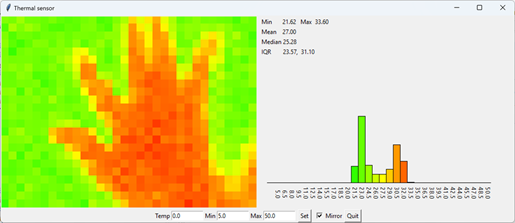

# mlx90640-bluetooth
Send real-time images from an mlx90640 Thermal Camera on a Raspberry Pi 
to a computer via Bluetooth and display the images.

The project has two parts, the server which runs on the Pi and uses Python 2.7. The client runs on the host machine and displays a user interface, its written in Python 3 and uses tkinter for graphics.

Depends on:
* [mlx90640-library](https://github.com/pimoroni/mlx90640-library) on Pi
* [PyBluez2](https://github.com/airgproducts/pybluez2/tree/master) on Client machine

## Server setup
The server code depends on the mlx90640-library being installed in the `/home/pi` directory. 
The library needs to be compiled together with the Python sub-directory. It run with a version circa 2019 and not been tested since.

The server program is `server/mlxserver.py` which needs to be run as root

    sudo python mlx90640-bluetooth/server/mlxserver.py

The server can be made to launch at boot time using the `mlxlauncher.sh` script. The following crontab line should work

    @reboot sh /home/pi/mlx90640-bluetooth/server/mlxlauncher.sh >> /home/pi/mlx90640-bluetooth/server/launcher.log 2>&1
    
Use `sudo crontab -e` to edit the crontab. 

## Client setup

The client needs some setup, the Pi and PC need to be paired, the MAC address for the pi needs to be manually inserted in the code, and the pybluez2 needs to be installed. 

First the Pi and PC need to be paired for the device to be found. To pair, first make the PC discoverable, then on the Pi left click on the Bluetooth icon on the top menu bar, and select `Add Device...` then follow the pairing instructions on both devices. Pairing the other way round has not been tested.

Once paired the Pi's MAC address needs to be inserted at the top of
`client/mlxclient.py`. This address can be found by running `tools/discover.py`

The client library relies on pybluez2 https://github.com/airgproducts/pybluez2/tree/master. Things seem to work better installing from source using

    pip install git+https://github.com/airgproducts/pybluez2.git@0.46

## Running

First get the server running, either manually or via the crontab. 

To run the client 

    python client/mlxclient.py

If Bluetooth connection is established then the user interface, with the image from the sensor is displayed, together with some statistics and a histogram of colours.
The temperature of a particular pixel can be sampled by clicking on the pixel. The colour scale can be adjusted by setting the min and max values and pressing the set
button. Clicking the mirror button flips the image horizontally so it appears like a mirror. To stop the client nicely and shutdown the socket use the quit button.

Communication can be a bit buggy and the client can sometimes hang-up. It may be necessary to reboot the Pi and possibly the PC to reestablish communication.   

## Versions

* 0.1 2019/20/3 - initial release, worked with older versions of pybluez 
* 0.2 2024/1/30 - works with pybluez2 version 0.46
